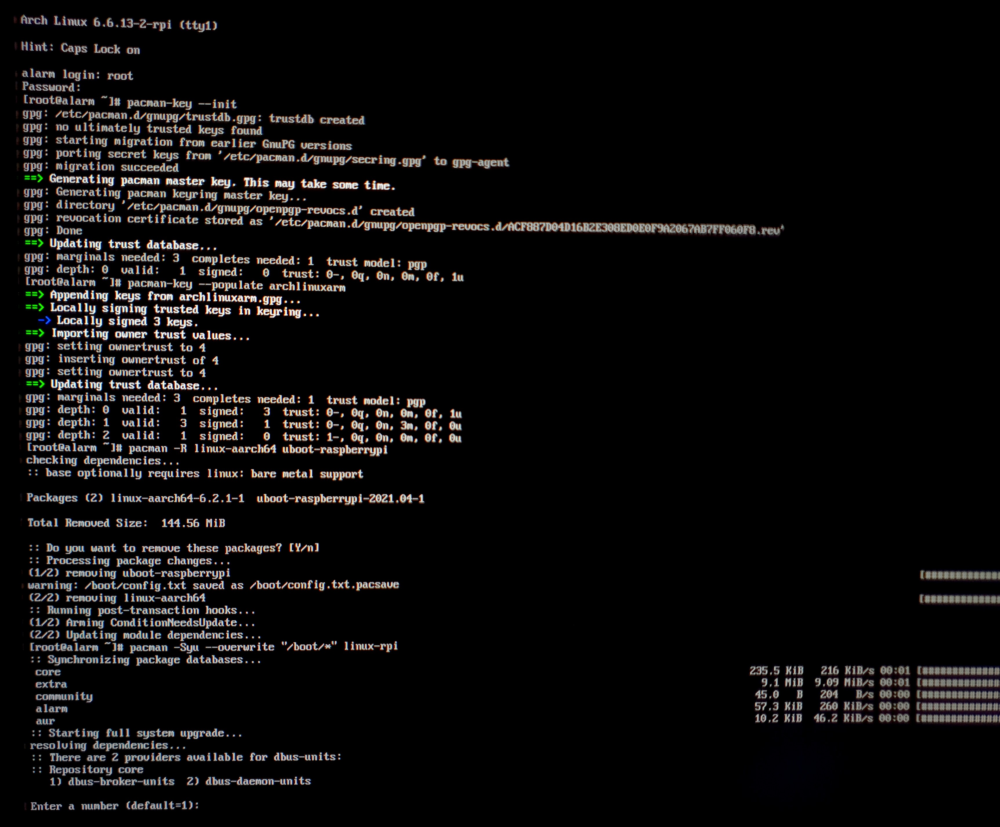
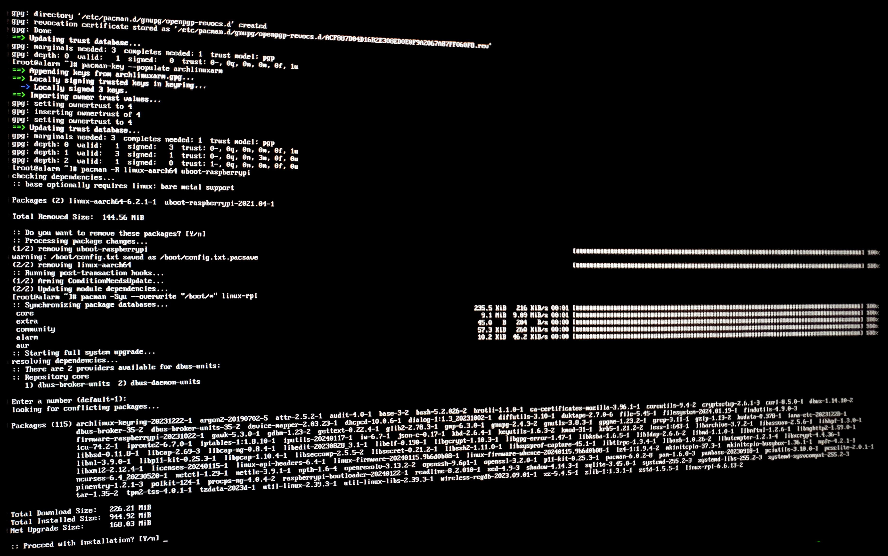
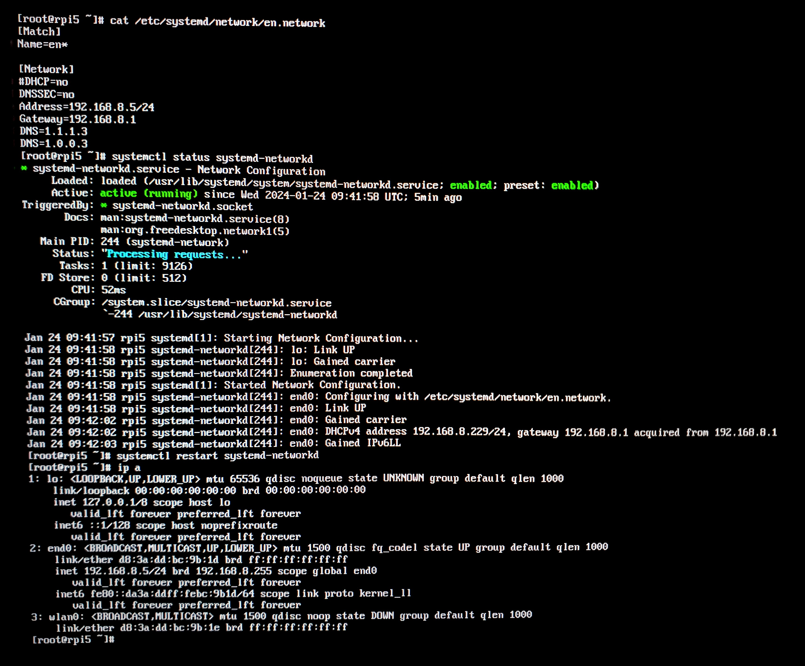
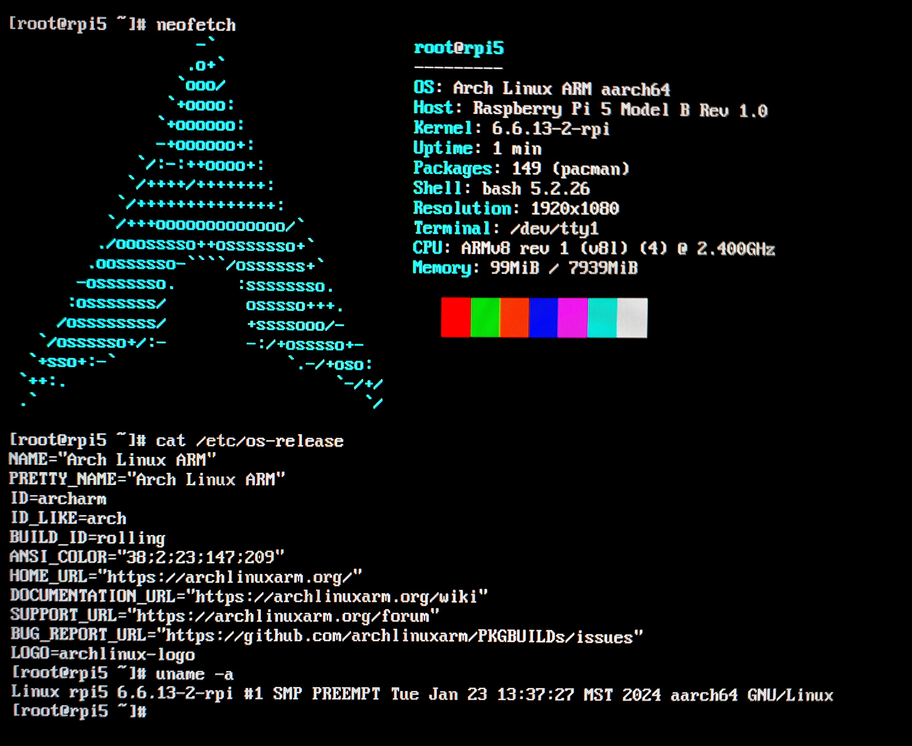

# rpi5-server
Raspberry Pi 5 | Arch Linux ARM server

***Idioma***
- 🇪🇸 Español
- [🇺🇸 English](https://github.com/fr4nsys/rpi5-server/blob/main/README-ENG.md)

### Nota Importante

Este repositorio está en proceso, se actualizará y detallarán los procesos.
Los comandos son para Arch Linux, si usas debian en tu rpi5 tendrás que buscar los comandos alternativos de instalación.

Deberás tener conocimientos básicos en Linux, estar cómodo trabajando con la línea de comandos y tener conocimientos básicos de redes.

# Instalación de Arch Linux ARM en la Raspberry Pi 5 (aarch64)

1. Ejecuta el siguiente comando para particionar la tarjeta SD (sustituye `/dev/sdx` por el nombre del dispositivo apropiado para tu tarjeta SD):
   ```
   fdisk /dev/sdx
   ```
   a. Escribe 'p' para verificar que esta sea la tarjeta SD correcta.
   b. Escribe 'g' para crear una nueva tabla de particiones GPT en la tarjeta.
   c. Escribe 'n' para crear una nueva partición.
   d. Presiona 'Enter' para aceptar el número de partición 1.
   e. Especifica el primer sector para la partición (por ejemplo, '65536' para 32MiB).
   f. Especifica el tamaño de la partición como '+256M' para 256MiB.
   g. Escribe 't' para establecer el tipo de partición.
   h. Presiona 'Enter' para aceptar la partición de destino 1.
   i. Escribe '1' para establecer el tipo de partición como 'EFI System'.
   j. Escribe 'n' para crear una nueva partición.
   k. Presiona 'Enter' para aceptar el número de partición 2.
   l. Presiona 'Enter' para aceptar el primer y último sector por defecto.
   m. Escribe 'w' para escribir los cambios en la tarjeta.

2. Script para automatizar la descarga de Arch Linux ARM, instalación en la microSD e instalción del kernal de la Raspberry Pi Foundation 'linux-rpi',
Asegurate de entender el script y definir las variables correspondientes a tu entorno.

	```
	wget https://github.com/fr4nsys/rpi5-server/install-arch-arch-rpi5.sh
	chmod +x install-arch-arch-rpi5.sh
	sudo ./install-arch-arch-rpi5.sh
	
	#Variables:
	export SDDEV=/dev/sdX
	export SDPARTBOOT=/dev/sdX1
	export SDPARTROOT=/dev/sdX2
	export SDMOUNT=/mnt/sdrpi
	export DOWNLOADDIR=/tmp/pi	
	```

      	```
      	#!/bin/sh

	# Variables:
	export SDDEV="/dev/sdX"
	export SDPARTBOOT="${SDDEV}1"
	export SDPARTROOT="${SDDEV}2"
	export SDMOUNT="/mnt/sdrpi"
	export DOWNLOADDIR="/tmp/pi"
	export DISTURL="https://fl.us.mirror.archlinuxarm.org/os/ArchLinuxARM-rpi-aarch64-latest.tar.gz"

	# Crear directorio de descarga
	mkdir -p "$DOWNLOADDIR"

	# Descargar Arch Linux ARM
	(
	  cd "$DOWNLOADDIR" || exit 1
	  curl -JLO "$DISTURL"
	)

	# Desmontar particiones si están montadas (para evitar errores)
	umount "$SDPARTBOOT" 2>/dev/null
	umount "$SDPARTROOT" 2>/dev/null

	# Formatear particiones
	mkfs.vfat -n BOOT -F32 "$SDPARTBOOT"
	mkfs.ext4 -L ROOT -E lazy_itable_init=0,lazy_journal_init=0 -F "$SDPARTROOT"

	# Montar particiones
	mkdir -p "$SDMOUNT"
	mount "$SDPARTROOT" "$SDMOUNT"
	mkdir -p "${SDMOUNT}/boot"
	mount "$SDPARTBOOT" "${SDMOUNT}/boot"

	# Extraer sistema de archivos Arch Linux ARM
	bsdtar -xpf "${DOWNLOADDIR}/ArchLinuxARM-rpi-aarch64-latest.tar.gz" -C "$SDMOUNT"

	# Eliminar U-Boot y el kernel principal manualmente
	rm -rf "${SDMOUNT}/boot/*"

	# Agregar el kernel de la Fundación Raspberry Pi
	mkdir -p "${DOWNLOADDIR}/linux-rpi"
	pushd "${DOWNLOADDIR}/linux-rpi" || exit 1

	# Si el enlace no funciona, encuentra una nueva versión aquí: http://fl.us.mirror.archlinuxarm.org/aarch64/core/
	curl -JLO http://fl.us.mirror.archlinuxarm.org/aarch64/core/linux-rpi-6.6.13-2-aarch64.pkg.tar.xz

	# Extracción y copia del kernel
	tar xf linux-rpi-6.6.13-2-aarch64.pkg.tar.xz
	cp -rf boot/* "${SDMOUNT}/boot/"
	popd

	# Desmontar la tarjeta SD de manera segura
	sync
	umount -R "$SDMOUNT"

	echo "Ahora, retire la tarjeta microSD y arranque su Raspberry Pi para completar la instalación."
	```
3. Configuración de la Raspberry Pi 5 con Arch Linux ARM ya instalado.

	Inicia la Raspberry Pi para actualizar Arch Linux ARM

	Inserta la tarjeta microSD en el Raspberry Pi, conéctalo a una red cableada con acceso a Internet y aplica la alimentación.
	Iniciar sesión

	Obtén acceso al Pi usando una pantalla HDMI y un teclado USB, o utiliza una conexión de red cableada (configurada para DHCP de forma predeterminada) con SSH o una conexión serial.

	Utiliza las credenciales predeterminadas de Arch Linux ARM.

	Nombre de usuario: alarm
	Contraseña: alarm

	Después de iniciar sesión, usa `su root` para obtener acceso de root. La contraseña de la cuenta root es 'root'.

	Todos los comandos siguientes se ejecutan en el Raspberry Pi como root.
	Actualizar Arch Linux ARM

	En los pasos anteriores, se eliminó el cargador de arranque y se reemplazó el kernel de manera forzada. Este "estado sucio" de archivos reemplazados manualmente no refleja los paquetes de Arch Linux ARM actualmente instalados. Esto debe corregirse primero eliminando los paquetes de los archivos que ya no están presentes. Luego, se debe instalar el paquete para el kernel actualmente utilizado.

	```bash
	pacman-key --init
	pacman-key --populate archlinuxarm

	pacman -R linux-aarch64 uboot-raspberrypi
	pacman -Syu --overwrite "/boot/*" linux-rpi
	```



	Reinicia la rpi. Antes puedes realizar configuraciones como definir el hostname, editar el archivo hosts, definir una ip statica, instalar openssh, etc.
	



	```bash
	reboot
	```

	Cuando el Pi llegue al prompt de inicio de sesión de usuario, la señal de video HDMI cambiará a una resolución más alta. Si tienes un ventilador compatible instalado en el encabezado del ventilador del Pi, este se controlará ahora en lugar de funcionar a velocidad máxima. Una vez que inicies sesión, notarás que con `ip addr` el adaptador de red inalámbrica está disponible.

	Eso es todo. Ahora tienes Arch Linux ARM básico funcionando en tu Pi 5.
	


	Actualización

	Si bien es cierto que Arch Linux ARM aún no admite la instalación en Raspberry Pi 5, efectivamente admite su funcionamiento, ya que todos los paquetes necesarios están disponibles en los repositorios oficiales. Esto incluye los últimos archivos de firmware. Estos archivos son necesarios para funciones como Wi-Fi y Bluetooth, y no se mencionaron anteriormente en esta guía porque no eran necesarios. Se actualizaron cuando se ejecutó `pacman -Syu`.

	Ejecutar `pacman -Syu` en el futuro también instalará el último kernel de la Fundación Raspberry Pi si hay una actualización disponible. Dado que las versiones actuales y más nuevas de los paquetes instalados admiten el Pi 5, seguirá funcionando sin problemas con software actualizado utilizando solo paquetes proporcionados por Arch Linux ARM.

	Manejo del futuro soporte oficial del Pi 5

	Cuando Arch Linux ARM comience a admitir el Pi 5, el kernel de la Fundación Raspberry Pi se podrá reemplazar por el kernel principal mediante la ejecución de:

	```bash
	pacman -Syu linux-aarch64 uboot-raspberrypi
	```

	Habrá una advertencia de que esos paquetes entran en conflicto con el paquete `linux-rpi` y si deseas reemplazarlo. Si lo haces, `linux-rpi` se eliminará antes de instalar los nuevos paquetes. Después de eso, tu instalación de Arch Linux ARM debería ser igual a la imagen oficial de Arch Linux ARM Raspberry Pi que admite el Pi 5.


# Servicios

### 1. Servidor de Medios con Plex o Kodi

**Instalación y Configuración de Plex en Arch Linux:**

1. **Instalación:**
   - Instala Plex Media Server: `paru -S plex-media-server`

2. **Configuración:**
   - Habilita y arranca Plex Media Server:
     ```
     sudo systemctl enable plexmediaserver.service
     sudo systemctl start plexmediaserver.service
     ```
   - Configura tu biblioteca de medios siguiendo las instrucciones en la interfaz web de Plex: `http://tu_raspberry_pi_ip:32400/web`

### 2. Estación de Juegos Retro con RetroPie

**Instalación de RetroPie:**

1. **Descarga e Instalación:**
   - RetroPie no tiene una instalación directa para Arch Linux, por lo que deberás compilar desde el código fuente.
   - Clona el repositorio de RetroPie: `git clone --depth=1 https://github.com/RetroPie/RetroPie-Setup.git`
   - Entra en el directorio: `cd RetroPie-Setup`
   - Ejecuta el script de instalación: `sudo ./retropie_setup.sh`

2. **Configuración:**
   - Sigue las instrucciones en el script para instalar los emuladores y configurar tus controladores.

### 3. Servidor de Archivos NAS con Samba

**Configuración de Samba para NAS:**

1. **Instalación:**
   - Instala Samba: `sudo pacman -S samba`

2. **Configuración:**
   - Edita el archivo de configuración `/etc/samba/smb.conf` para configurar tus comparticiones.
   - Reinicia el servicio Samba: `sudo systemctl restart smb.service`

### 4. Estación de Monitoreo de Red con Nagios

**Instalación de Nagios:**

1. **Instalación:**
   - Instala Nagios: `sudo pacman -S nagios`
   - Instala los plugins de Nagios: `sudo pacman -S nagios-plugins`

2. **Configuración:**
   - Configura Nagios editando los archivos en `/etc/nagios`.
   - Inicia Nagios: `sudo systemctl start nagios.service`

### 5. VPN o Firewall de Red

**Configuración de OpenVPN o iptables (aunque seguramente utilize WireGuard):**

1. **OpenVPN:**
   - Instala OpenVPN: `sudo pacman -S openvpn`
   - Configura OpenVPN siguiendo la documentación oficial.

2. **Iptables:**
   - Instala iptables: `sudo pacman -S iptables`
   - Configura las reglas de iptables según tus necesidades de red.

### 6. Servidor Web o de Desarrollo

**Instalación de Apache/NGINX y Lenguajes de Programación:**

1. **Servidor Web:**
   - Instala Apache o NGINX: `sudo pacman -S apache` o `sudo pacman -S nginx`
   - Configura tu servidor editando los archivos de configuración en `/etc/httpd` (para Apache) o `/etc/nginx` (para NGINX).

2. **Lenguajes de Programación:**
   - Instala PHP, Python, etc., según tus necesidades: `sudo pacman -S php python`

# Exponer servicios en internet

En esta parte se mostrará la configuración de una Raspberry Pi para hospedar varios servicios, utilizando Nginx como proxy inverso y gestionando un dominio dinámico con DuckDNS. También incluiremos la obtención de certificados SSL/TLS con Let's Encrypt y la configuración específica de Nextcloud, entre otros servicios.

### Paso 1: Registro en DuckDNS y Creación de un Subdominio

- Regístrate en DuckDNS: Visita [DuckDNS](https://www.duckdns.org/) y crea una cuenta.
- Crea un subdominio en DuckDNS y anota el token proporcionado.

### Paso 2: Configuración del Cliente de DNS Dinámico en Raspberry Pi

- Abre una terminal y ejecuta:

  ```bash
  paru -S duckdns
  ```

- Crea y edita un archivo de configuración para DuckDNS:

  ```bash
  nano /etc/duckdns/duckdns_token
  ```

  Añade tu token de DuckDNS aquí.

- Crea un script para actualizar la IP en DuckDNS:

  ```bash
  nano /usr/local/bin/duckdns.sh
  ```

  Copia y pega el script proporcionado y reemplaza "tu-subdominio-duckdns" y "tu-token-duckdns" con tus datos.

- Haz que el script sea ejecutable:

  ```bash
  sudo chmod +x /usr/local/bin/duckdns.sh
  ```

### Paso 3: Configuración del Router

- Configura el reenvío de puertos (Port Forwarding) en tu router para redirigir los puertos 80 (HTTP) y 443 (HTTPS) a la IP local de tu Raspberry Pi.

### Paso 4: Instalación de Nginx

- Instala Nginx:

  ```bash
  sudo pacman -S nginx
  ```

### Paso 5: Configuración de Nginx como Proxy Inverso

- Crea y configura un archivo de sitio para Nginx:

  ```bash
  sudo nano /etc/nginx/sites-available/miservicio
  ```

  Añade la configuración de proxy inverso proporcionada, ajustando tu subdominio DuckDNS.

- Habilita el sitio:

  ```bash
  sudo ln -s /etc/nginx/sites-available/miservicio /etc/nginx/sites-enabled/
  ```

### Paso 6: Obtención de Certificados SSL/TLS con Let's Encrypt

- Instala Certbot y su integración con Nginx:

  ```bash
  sudo pacman -S certbot certbot-nginx
  ```

- Solicita y configura automáticamente un certificado SSL/TLS:

  ```bash
  sudo certbot --nginx -d tu-subdominio-duckdns.duckdns.org
  ```

### Paso 7: Instalación de Nextcloud

- Sigue las instrucciones de instalación de Nextcloud desde su [sitio web oficial](https://nextcloud.com/install/), que incluirá la instalación de PHP, una base de datos (MySQL/MariaDB), y otras dependencias.

### Paso 8: Configuración de Otros Servicios

- Repite el proceso de instalación y configuración para otros servicios que desees, como Rocket.Chat o Matrix Synapse.

### Paso 9: Reinicio de Nginx y Programación de Actualización de IP DuckDNS

- Reinicia Nginx:

  ```bash
  sudo service nginx restart
  ```

- Configura una tarea cron para actualizar la IP en DuckDNS:

  ```bash
  crontab -e
  ```

  Añade:

  ```bash
  */5 * * * * /usr/local/bin/duckdns.sh >/dev/null 2>&1
  ```

Con estos pasos, deberías tener tu Raspberry Pi configurada para servir varios servicios a través de Nginx con HTTPS, utilizando un dominio DuckDNS y manteniendo tu IP actualizada. Recuerda reemplazar las partes del script y las configuraciones con tus propios datos de subdominio y token.

### Consideraciones Finales
- **Gestión de recursos**: Monitoriza el uso de CPU y memoria regularmente.
- **Almacenamiento**: Utiliza discos duros externos o almacenamiento en red para archivos multimedia y juegos.
